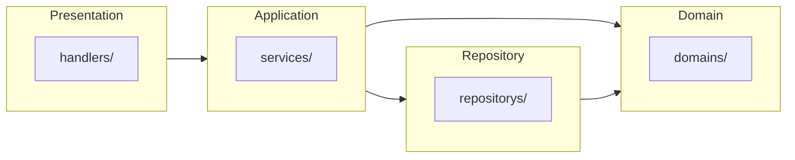

# go-api-server-echo
[](https://github.com/golang/go/releases/tag/go1.18)

An API server example using Echo with Swagger.

## Dependencies

- Go Framework - [Echo](https://github.com/labstack/echo)
- RESTful API doc generater - [echo-swagger](https://github.com/swaggo/echo-swagger)
- Environment Variables - [GoDotEnv](https://github.com/joho/godotenv)

Detail : go.mod

## Architecture

### Layered Architecture
Note : The dependency of repository on domain should be fixed. 



### Directory
|key|value|
|---|-----|
|handlers|controller, routing|
|services|usecase, Application Logic|
|repository|data store|
|docs|API documents to generated with Swagger<br>:warning:**Note: Don't change directly. Must use swagger cmd.**|
|configs|Not in use now|

## Installation

Create go.sum:
```sh
go mod tidy
```

## Usage

1. Run `go run .` to start server.
2. Open http://localhost:3000 with your browser to see the result.
3. Open http://localhost:3000/swagger/index.html, you can see Swagger Api documents.


### Get albums

Request (GET):
```sh
curl 'http://localhost:3000/albums'
```

Response body:
```sh
[
  {
    "id": 1,
    "title": "Blue Train",
    "artist": "John Coltrane",
    "price": 56.99
  },
  {
    "id": 2,
    "title": "Jeru",
    "artist": "Gerry Mulligan",
    "price": 17.99
  },
  {
    "id": 3,
    "title": "Sarah Vaughan and Clifford Brown",
    "artist": "Sarah Vaughan",
    "price": 39.99
  }
]
```

### Post album

Request (POST):
```sh
curl -X POST 'http://localhost:3000/albums' -H 'Content-Type: application/json' -d '{"id":4, "title":"Sun", "artist":"Apple", "price":10.12}'
```

Response body:
```sh
Accepted
```

## Environment

The environment is determined by `.env`.

development: ([.env .development](https://github.com/skport/go-api-server-echo/blob/main/.env%20.development)):
```Shell
APP_ENV=development
```

other: ([.env .inmemory](https://github.com/skport/go-api-server-echo/blob/main/.env%20.inmemory)):
```Shell
APP_ENV=inmemory
```

If "development" is selected, the datastore is a MySQL server. and a Docker container must be started for MySQL. [=>](#create-containers-for-mysql--adminer)

Otherwise, the datastore is in-memory and no DB server is required.

**Note: `.env` should normally be added to `.gitignore`.**

## Generate API documents using Swagger

1. Install Swag

```sh
go install github.com/swaggo/swag/cmd/swag@lates
```

2. Write API annotations to go file. ([Swagger Document](https://github.com/swaggo/swag#declarative-comments-format))

3. Run `swag init` and generate API documents in `/docs` directory.

```sh
swag init
```

4. Restart Server.

## Create Containers for MySQL & Adminer

```sh
docker-compose up -d
```

|key|host|port|view|
|---|---|---|---|
|app|127.0.0.1|3000|http://localhost:3000/|
|db|127.0.0.1|3306||
|adminer|127.0.0.1|8080|http://localhost:8080/|

If you want a go execution environment container, use the `app` container. After the container shell is started, the prescribed flow is simply performed within the container.

1. [Installation](#Installation)
2. [Usage](#Usage)

## Testing

```sh
go test ./handlers/ -v
```

In the `go test` command for handlers, the data store is always in-memory.

## ToDo
More Code Design.
